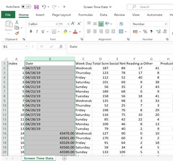

Yoga-Screentime
# How can incorporating yoga into your daily routine impact screen time?

## About the dataset 

This dataset spans between April 17th 2019 to May 14th 2019 (28 days) and comprises of data for screen time habits in daily minutes for one individual. The dataset used comes from a public Kaggle dataset uploaded by The Devastator/ Taylor L. Bailey. See link for dataset: https://www.kaggle.com/datasets/thedevastator/how-does-daily-yoga-impact-screen-time-habits?resource=download&select=Screen+Time+Data.csv Screen time was recorded considering the amount of time spent on using different types of apps. These include social media, reading, productivity and entertainment. Yoga when attempted was done for 10 minutes per day. The data is provided with context which will enable for much more accurate insights regarding the data. 

+	Date – the date of screen time 
+	Weekday – to identify exactly the day of screen time.
+	Social Networking, Reading and reference, Other, Productivity, Health and Fitness – time in minutes spent of these apps.
+	Yoga – if yoga was done that day.

## ASK: 
As this dataset is only for exploratory purposes, I have compiled some questions to try and answer during analysis.

Questions:
### 1.	What trends can we see when yoga is incorporated into a daily routine and when it is not?
### 2.	How does incorporating regular yoga into a daily routine influence phone use?
### 3.	What relationships can we see between day of the week and specific screen times?

### Limitations to consider:
+ Sample size: The data is collected using one individual’s screen time so cannot be used to make assumptions regarding a whole population.
+ Historic data – Data was collected from April 17th 2019 to May 14th 2019, so is not current and has not been updated.
+ Duration of data – the data is only representative of one month, the longer the duration of the data, the more insights. For example: the duration to form a healthy habit. 
+ Demographic information: The age or gender was not recorded for the individual who collected this data which might prove some better insights when analysing the data.
+ Survey – this data may be accurate as it is recorded by a device but no evidence is shown to support this. 

Tools: As this is a smaller dataset, I will use Microsoft Excel to clean and analyse data. I will then use Tableau to form a small dashboard, illustrating my exploratory findings to the questions asked.

## PROCESS: 
1.	Firstly, I created a copy of the data into another tab of an excel workbook so I have two versions of the same data. The original and the one to be cleaned, this is to prevent losing any data that could be removed whilst cleaning.

2.	When initially looking at the data, I can see that some dates are not stored as true dates which is confirmed when trying to convert them to format ‘Number’. This suggests that these dates are delimited. I used the ‘text to columns’ tab to define the format of the dates which then converts the selected cells to the appropriate format. 

3.	I converted all the other columns to their appropriate data type. 
-	‘Index’ = Number
-	‘Weekday’ = Text
-	Categories = Number to 1.d.p.

This screenshot shows that when I try to convert the dates to Number Format, not all of them convert to date serial numbers

After using the 'text to columns' tab, I was able to define to format of the data which resulted in the dataset being set to the correct format of DD/MM/YYYY.

4.	I used conditional formatting to see if there are any duplicate values regarding dates which there isn’t any. I did the same with the Index column which returned no duplicates.

5.	I also checked for any missing data using conditional formatting, data was complete.

6.	In the ‘Yoga’ column, there is only one of two options, 0 means no yoga and 1 means yoga. I will keep these as they are for the time being in case I need to carry out calculations which only allow for numeric values.

7. 	I converted the tabular dataset into a table so I could apply filters to analyse the data. 

8.	The data for ‘Health and Fitness’, ‘Entertainment’ and ‘Creativity’, I will not use as they will skew analysis. Data is usually 0 minutes for these columns with sporadic days of activity.

## ANALYSE:

1.	Firstly, I confirmed the duration of 28 days for data by using the COUNT function. As the data has been transformed into a table, it makes it easier to carry out statistical calculations, such as COUNT, AVG, MAX AND MIN using filters at the end of columns.

2.	I created a pivot table and focused on average screen time and the day of the week to see what day screen time was the highest and the lowest.

 
I organised the data to show screen time from highest to lowest. We can see that Wednesday is the day where screen time is the highest at an average of 142.75 minutes and Sunday as the lowest at average 81.5 minutes over the 28 days.

3.	The most screen time is spent using social media at an average of 60 minutes a day over the week as compared to other categories.

4.	Comparing the months of April and May, it shows that screen time is reduced by 16.4 minutes of average in the month of May where yoga was incorporated daily. On the other hand, we can see that social networking didn’t change significantly between the two months, in fact, it increased slightly in May where yoga was incorporated into the daily routine.

5.	There was a decrease in screen time amongst ‘Reading and Reference’, ‘Other’ and ‘Productivity’ of 5.86 minutes, 13.07 minutes and 0.43 minutes in the month of May where yoga was incorporated daily.

6.	I will compare week by week for each month and see if there is anything I can pick up from comparisons. I will do this by each day of the week for 4 weeks.

Here I can already see that as each Wednesday goes by, the total screen time decreases. 187 minutes to 135 minutes, to 127 minutes and finally 122 minutes in the last week. Between the first two weeks of no yoga and the last two weeks of completed yoga, total screen time has a total reduction of 65 minutes. I see a similar trend for Saturday. All other days tend to increase and decrease between the 4 weeks for total screen time. I can also see that time spent on social networking decreases from around 1.5 hours for the first three Wednesdays to under 1 hour in the last Wednesday. Sunday and Monday also show the shortest time spent social networking in the fourth week where yoga is incorporated. Other days fluctuate or remain steady regarding social networking and other categories so I cannot detect a trend between days for the four-week period. As results are not consistent with these findings across all days, I cannot use this data to make any assumptions for the weeks.
 
## SHARE:
I produced a visualisation illustrating significant findings using Tableau. Please click this link: https://public.tableau.com/views/Howcanincorporatingyogaintoyourdailyroutineimpactscreentime/Dashboard1?:language=en-GB&:display_count=n&:origin=viz_share_link

### The overall conclusions I have interpreted are as follows:
1.	Overall, Total Screen Time reduced by 16.1 minutes on average between April and May.
2.	Social networking stayed at around 60 minutes between April and May, showing that Yoga had no impact on time spent on networking.
3.	On average, Wednesday proved to be the day of highest screen time over the 28 days and Sunday as the lowest.
4.	Productivity, Reading and Reference and Other collectively had a reduced screen time between April and May. 
 
Although Total Screen Time did reduce by 16.1 minutes, this was not significantly impacted by time spent on social networking but by other apps such as Productivity, Reading and Reference and Other. Screen time was impacted by the incorporation of yoga, however further investigation is needed to confirm these findings.

### Suggestions for further investigation:
+	Collect data from a larger group of individuals to see how they compare with each other and therefore represent a larger population.
+	Collect data across a longer duration to determine how long it takes for a habit to develop.
+	Record sleeping habits and see if yoga has an impact on this.
+	Ensure collection of data is from a variety of demographics when selecting individuals to accurately represent populations.
